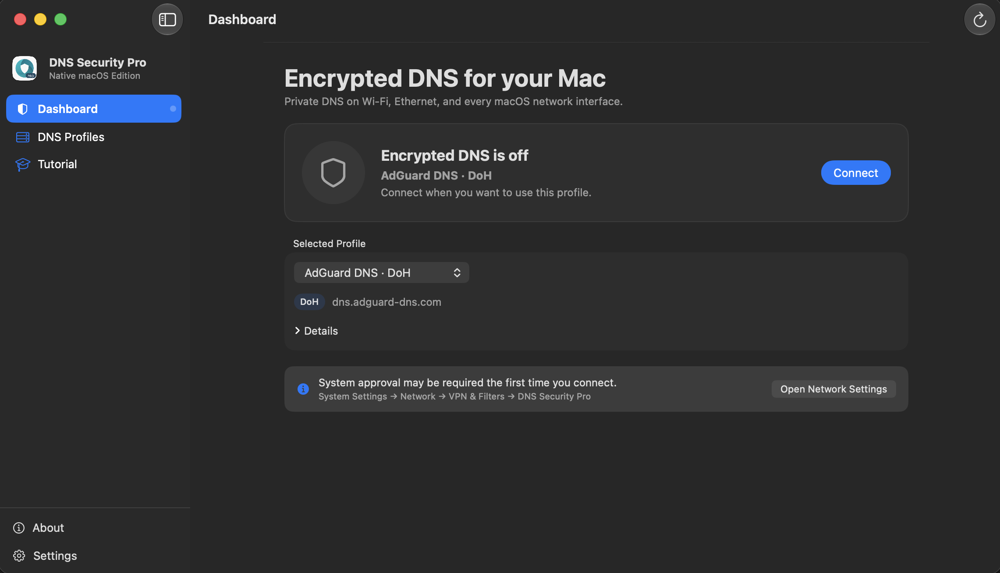

# DNS Security Pro for macOS



[](https://github.com/peterlee0127/DNS-Security-Pro-macOS/actions/workflows/build.yml)

This folder contains a standalone, native macOS SwiftUI app for managing
system-wide DNS over HTTPS (DoH) and DNS over TLS (DoT) profiles. It does not
use Mac Catalyst and does not compile source files from the iOS project.

## iOS apps

DNS Security is also available for iPhone and iPad. Both editions protect DNS
queries with DNS over HTTPS (DoH) and DNS over TLS (DoT) without routing other
network traffic through a VPN:

- [DNS Security](https://apps.apple.com/tw/app/dns-security/id1537782072?l=en-GB) —
  the free edition, with optional in-app purchase for Pro features.
- [DNS Security Pro](https://apps.apple.com/tw/app/dns-security-pro/id1533938029?l=en-GB) —
  the full edition with advanced features such as custom DNS profiles, Wi-Fi
  rules, built-in profile updates, and URL scheme support.

## License

The source code and associated documentation are available under the
[MIT License](LICENSE). The DNS Security Pro name, logo, and app icon are not
included in that license. Forks should use their own product identity; see
[TRADEMARKS.md](TRADEMARKS.md) for details.

## Open and build

Open `DNSSecurityProMac.xcodeproj` and run the shared **DNS Security Pro macOS**
scheme, or build from Terminal:

```sh
xcodebuild \
  -project DNSSecurityProMac.xcodeproj \
  -scheme "DNS Security Pro macOS" \
  -destination 'platform=macOS' \
  build
```

The app currently targets macOS 14 or later. It uses the
`NEDNSSettingsManager` API that Apple provides for native macOS apps.

## Setup tutorial

The app includes the same walkthrough under **Tutorial** in the sidebar, with
buttons that take users directly to each relevant screen.

1. Open **DNS Profiles** and select one of the built-in DoH/DoT resolvers, or
   add a custom profile. Custom DoH profiles require an `https://` endpoint;
   custom DoT profiles require a TLS server name and at least one bootstrap IP.
   The app rejects malformed endpoints and non-IP bootstrap values before they
   can be saved.
2. Return to **Dashboard** and choose **Connect**. The app installs the selected
   encrypted DNS configuration for all macOS network interfaces.
3. Approve the DNS configuration when macOS requests permission. This system
   approval is normally needed only on the first connection. If approval is
   still pending, open **System Settings → Network → VPN & Filters → DNS
   Security Pro**, then approve the DNS configuration. Dashboard and Tutorial
   provide an **Open Network Settings** button that opens the Network page.
4. Confirm that Dashboard shows a green shield and **Encrypted DNS is active**.
   Use **Refresh DNS Status** if the system state has not updated yet.
5. Open **Settings** and choose how the app should remain available:
   - Keep **Show DNS Security Pro in the menu bar** enabled for quick profile
     switching and connect/disconnect controls.
   - Turn the menu bar item off if the app only needs to be opened when making
     changes.
   - Enable **Quit after applying DNS changes** if the app should close after a
     successful connect, disconnect, or active-profile change.

Closing or quitting the app does not disable an installed DNS profile. Open the
app and choose **Disconnect** when you want macOS to return to its normal system
DNS configuration.

## Signing requirement

Installing DNS settings requires the Network Extension `dns-settings`
entitlement. The project contains the expected entitlement declaration, but a
developer building a distributable copy must use an Apple Developer team and a
provisioning profile authorized for that capability. A build with code signing
disabled verifies compilation but cannot install a system DNS profile.

## Architecture

- `Models/DNSProfile.swift`: portable profile data and validation.
- `Services/DNSProfileRepository.swift`: local JSON persistence in Application
  Support; built-in profiles remain immutable.
- `Services/SystemDNSManager.swift`: the only layer that writes
  `NEDNSSettingsManager` preferences.
- `ViewModels/AppModel.swift`: app state and profile operations.
- `Views/`: compact native macOS dashboard, split-view profile management,
  inline custom-profile editing, an interactive setup tutorial, Settings, menu
  bar controls, and mobile-app promotion.

The optional menu bar extra exposes DNS status, profile switching, connect and
disconnect actions, status refresh, Settings, and the main window. In Settings,
users can hide the menu bar item or ask the app to quit after a successful DNS
change. The installed system DNS configuration remains active after the app
quits.

The Dashboard can send a real encrypted DNS query to the selected resolver and
show its round-trip latency. Tests use an RFC 8484 DNS message for DoH and a
length-prefixed DNS message over a certificate-validated TLS connection for
DoT. The test does not use a third-party leak-test or analytics service.

Custom profiles can include automatic rules:

- Disable the encrypted resolver on selected Wi-Fi SSIDs.
- Exclude selected domains and their subdomains so they use the normal system
  DNS resolver.

Profile management also supports search, protection labels, testing every
resolver, and importing or exporting custom profiles as a versioned JSON
archive. Existing profile files remain compatible when the additional metadata
and automatic-rule fields are absent.

Additional macOS integrations include launch at login, optional notifications
when a DNS change fails, and keyboard shortcuts:

- `Shift-Command-D`: connect or disconnect encrypted DNS.
- `Shift-Command-R`: refresh the macOS DNS status.
- `Shift-Command-T`: test the selected resolver.

DNS changes are disabled while the current macOS DNS state is still loading or
cannot be read. The dashboard shows a separate unavailable state and retry
action instead of incorrectly reporting that DNS is off.

The app stores only custom profiles and the selected profile ID. Built-in
profiles remain source-controlled, so updates cannot accidentally turn them
into editable user data.

## Before publishing as open source

- Replace the bundle identifier and development team if the repository moves
  to another owner.
- Confirm permission to publicly redistribute the current app icon and brand
  assets, even though they remain excluded from the MIT License.
- Add privacy/support URLs and release metadata before App Store submission.
# DNS-Security-Pro-macOS
